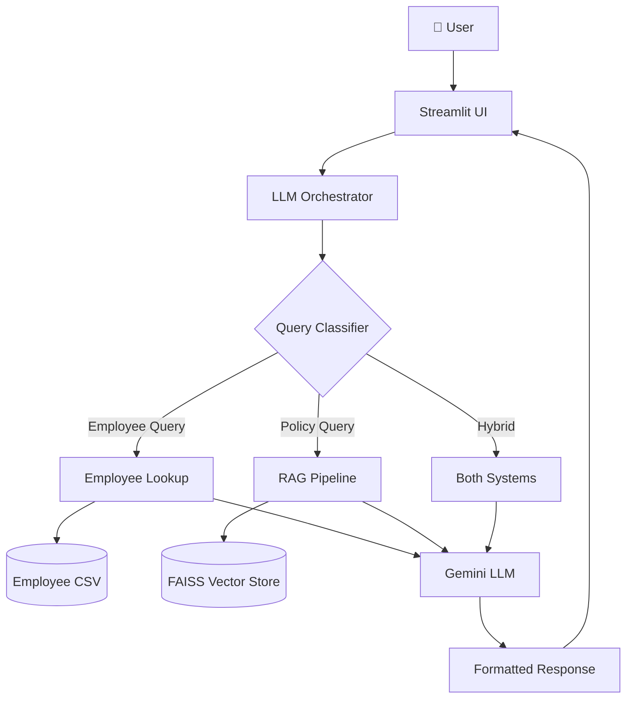
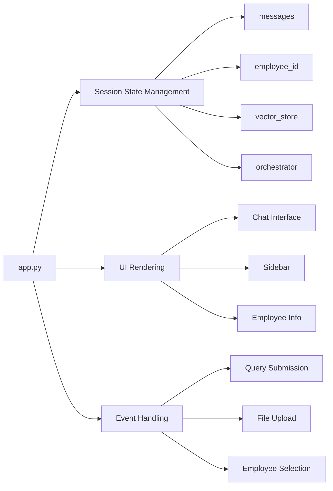
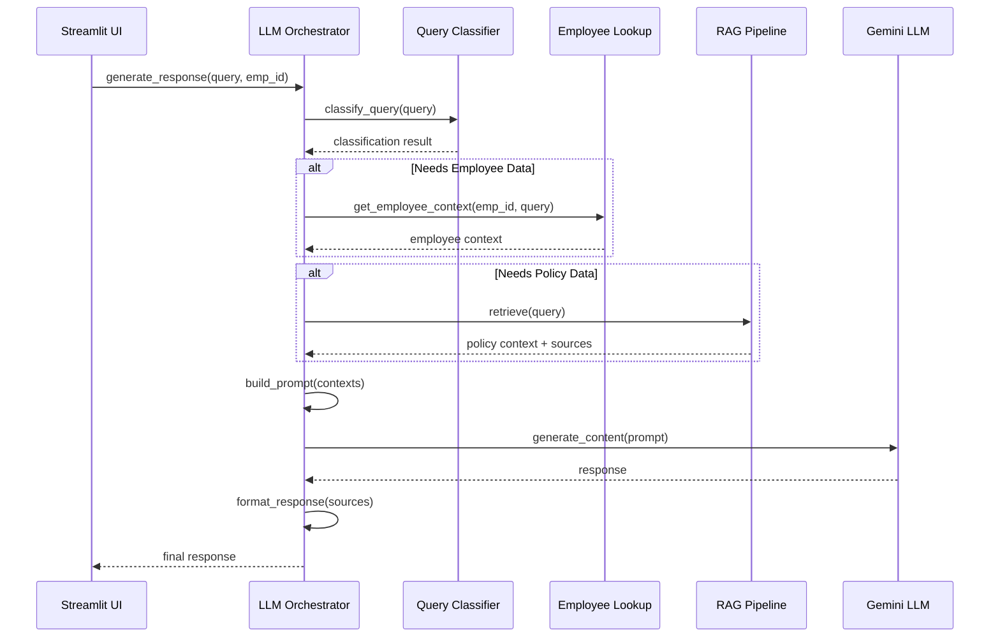
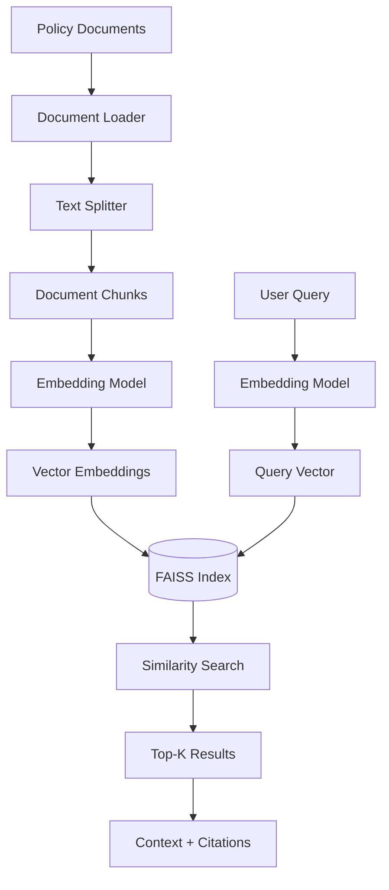
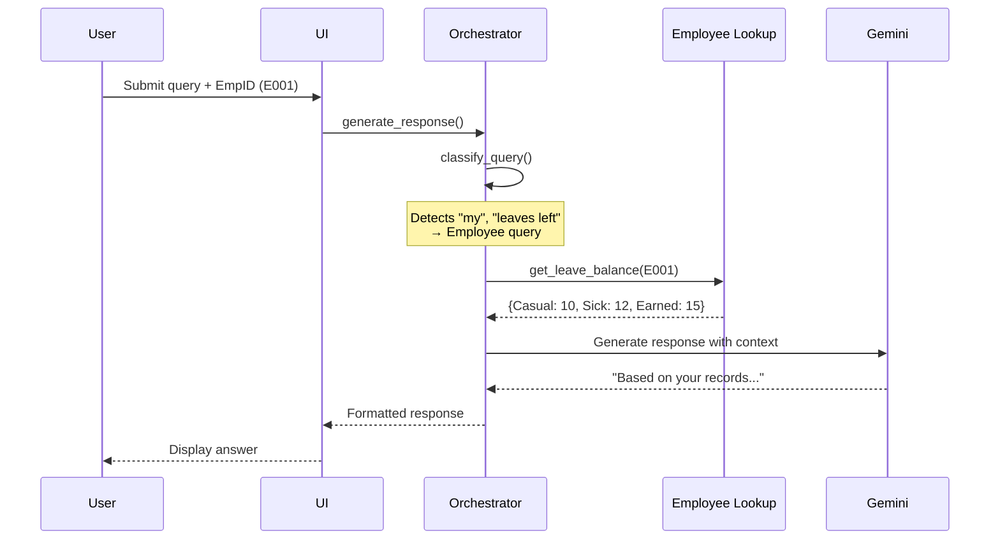
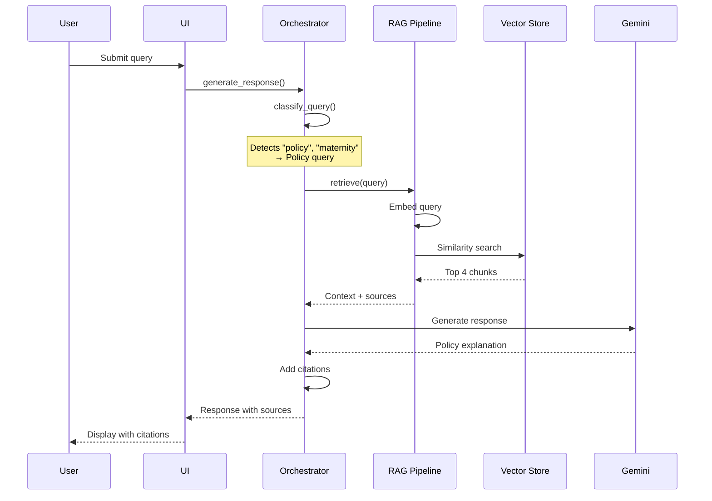
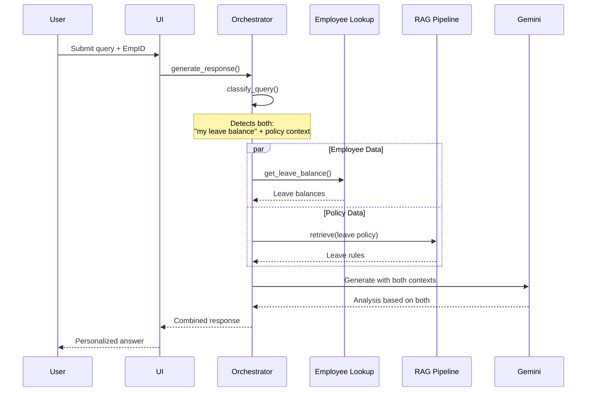
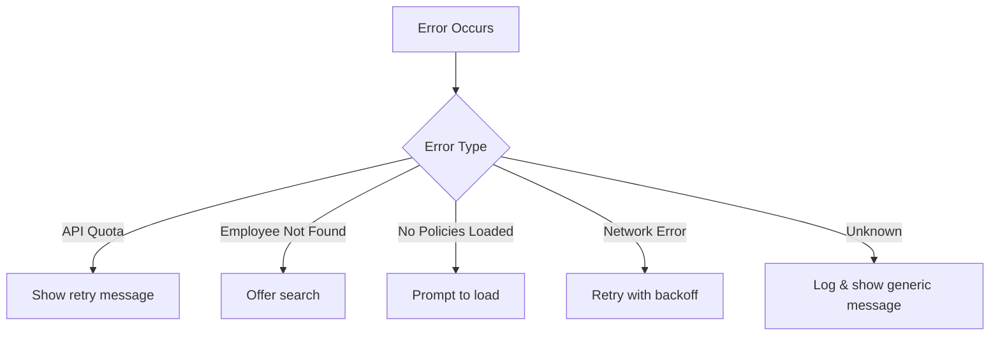

# System Architecture - HR Assistant Agent

## Overview

The HR Assistant Agent is a conversational AI system that combines **Retrieval Augmented Generation (RAG)** for policy questions with **structured data lookup** for employee-specific queries. This document describes the system architecture, component interactions, and data flow.

## High-Level Architecture



## Component Architecture

### 1. User Interface Layer

**Component:** `app.py` (Streamlit Application)

**Responsibilities:**
- Render chat interface and sidebar
- Manage session state (messages, employee selection, vector store)
- Handle file uploads for policy documents
- Display employee information and leave balance
- Route user queries to orchestrator

**Key Features:**
- Employee ID selector
- PDF/TXT document uploader
- Chat history display
- Real-time response streaming
- Leave balance sidebar



---

### 2. Orchestration Layer

**Component:** `src/llm_orchestrator.py`

**Responsibilities:**
- Classify incoming queries
- Route queries to appropriate data sources
- Gather context from employee data and/or policy documents
- Generate responses using Google Gemini
- Format responses with citations

**Query Classification Logic:**

```python
# Keyword-based classification
EMPLOYEE_KEYWORDS = ["my", "i", "balance", "manager", "leaves left"]
POLICY_KEYWORDS = ["policy", "benefits", "maternity", "handbook"]

# Classification result determines data source
{
    "needs_employee_data": bool,
    "needs_policy_data": bool,
    "query_type": "employee" | "policy" | "hybrid" | "general"
}
```

**Flow Diagram:**



---

### 3. RAG Pipeline Layer

**Component:** `src/rag_pipeline.py`

**Responsibilities:**
- Load and process policy documents (PDF, TXT)
- Chunk documents using RecursiveCharacterTextSplitter
- Generate embeddings using HuggingFace models
- Store embeddings in FAISS vector database
- Perform semantic search for relevant context
- Provide source citations

**RAG Architecture:**



**Processing Pipeline:**

1. **Document Loading**: Read PDF/TXT files
2. **Chunking**: Split into 1000-char chunks with 200-char overlap
3. **Embedding**: Convert chunks to 384-dim vectors (HuggingFace)
4. **Indexing**: Store in FAISS for fast retrieval
5. **Retrieval**: Semantic search returns top-4 most relevant chunks
6. **Context Formatting**: Combine chunks with source attribution

**Configuration:**
```python
CHUNK_SIZE = 1000          # Characters per chunk
CHUNK_OVERLAP = 200        # Overlap between chunks
RETRIEVAL_K = 4            # Number of chunks to retrieve
EMBEDDING_MODEL = 'sentence-transformers/all-MiniLM-L6-v2'
```

---

### 4. Employee Data Layer

**Component:** `src/employee_lookup.py`

**Responsibilities:**
- Load employee data from CSV
- Query employee information by ID
- Retrieve leave balances, manager info, department details
- Format responses in friendly HR tone
- Handle missing or invalid employee IDs gracefully

**Data Schema:**

```csv
EmpID,Name,Email,Phone,Department,Role,Manager,JoiningDate,CasualLeave,SickLeave,EarnedLeave
E001,John Doe,john@company.com,+91-1234567890,Engineering,Engineer,Jane Smith,2020-01-15,10,12,15
```

**Query Methods:**
- `get_employee_info(emp_id)` - Complete employee record
- `get_leave_balance(emp_id)` - Leave balances only
- `get_manager_info(emp_id)` - Manager details
- `get_department_info(emp_id)` - Department and role
- `search_employee(name)` - Search by name
- `get_employees_by_department(dept)` - Filter by department

---

### 5. LLM Layer

**Component:** Google Gemini API

**Model:** `gemini-2.0-flash`

**Responsibilities:**
- Generate human-like responses based on context
- Maintain conversational tone
- Provide accurate, policy-aligned answers
- Synthesize information from multiple sources

**Configuration:**
```python
MODEL_NAME = "gemini-2.0-flash"
TEMPERATURE = 0.7           # Balance creativity/consistency
MAX_TOKENS = 1024           # Response length limit
```

**Prompt Structure:**

```
You are an HR assistant helping employees with HR-related questions.

[CONTEXT - Employee Data]
{employee_context}

[CONTEXT - Policy Documents]
{policy_context}

[CONVERSATION HISTORY]
{previous_messages}

[CURRENT QUESTION]
{user_query}

[INSTRUCTIONS]
- Provide accurate, friendly responses
- Cite sources for policy information
- Be specific when using employee data
- Maintain professional HR tone
```

---

## Data Flow

### Scenario 1: Employee-Specific Query

**Query:** "How many casual leaves do I have left?"



---

### Scenario 2: Policy Query

**Query:** "What is our maternity leave policy?"



---

### Scenario 3: Hybrid Query

**Query:** "Based on my leave balance, can I take 10 days off?"



---

## Technology Stack

### Frontend
| Technology | Purpose | Version |
|------------|---------|---------|
| Streamlit | Web UI framework | ≥1.28.0 |
| Python | Programming language | 3.8+ |

### Backend
| Technology | Purpose | Version |
|------------|---------|---------|
| LangChain | RAG orchestration | ≥0.1.0 |
| FAISS | Vector database | ≥1.7.4 |
| Pandas | Data manipulation | ≥2.0.0 |

### AI/ML
| Technology | Purpose | Version |
|------------|---------|---------|
| Google Gemini | LLM (gemini-2.0-flash) | Latest |
| HuggingFace | Embeddings (all-MiniLM-L6-v2) | ≥2.2.0 |
| PyPDF | PDF processing | ≥3.17.0 |

### Configuration
| Technology | Purpose | Version |
|------------|---------|---------|
| python-dotenv | Environment variables | ≥1.0.0 |

---

## File Structure

```
HRAssistant-Agent/
├── app.py                          # Main Streamlit application
├── config.py                       # Configuration settings
├── requirements.txt                # Python dependencies
├── .env.example                    # Environment template
├── .gitignore                      # Git ignore rules
│
├── src/                            # Source code
│   ├── __init__.py
│   ├── employee_lookup.py          # Employee data queries
│   ├── rag_pipeline.py             # RAG implementation
│   ├── llm_orchestrator.py         # Query routing & LLM
│   └── utils.py                    # Helper functions
│
├── data/                           # Data files
│   ├── employee_data.csv           # Employee database
│   └── policies/                   # Policy documents
│       ├── leave_policy.txt
│       ├── benefits_handbook.txt
│       └── onboarding_guide.txt
│
└── docs/                           # Documentation
    └── architecture.md             # This file
```

---

## State Management

### Streamlit Session State

```python
st.session_state = {
    'messages': [],              # Chat history
    'employee_id': None,         # Selected employee
    'embeddings': None,          # Cached embeddings model
    'rag_pipeline': None,        # Cached RAG pipeline
    'orchestrator': None,        # Cached orchestrator
    'employee_lookup': None,     # Cached employee lookup
    'documents_loaded': False    # Policy loading status
}
```

### Caching Strategy

```python
@st.cache_resource
def get_cached_embeddings():
    # Heavy initialization, cache globally
    return HuggingFaceEmbeddings(...)

@st.cache_data(ttl=3600)
def load_employee_data():
    # Data that changes infrequently
    return pd.read_csv(...)
```

---

## Security Considerations

### API Key Management
- Stored in `.env` file (gitignored)
- Loaded via `python-dotenv`
- Never hardcoded in source

### Data Privacy
- Employee data is sample/demo only
- For production: implement authentication
- Consider RBAC for sensitive queries

### Input Validation
- Employee ID format validation
- Query sanitization
- File upload restrictions (PDF/TXT only)

---

## Performance Characteristics

### Latency

| Operation | Typical Time |
|-----------|--------------|
| Employee lookup | < 50ms |
| RAG retrieval | 100-300ms |
| LLM response generation | 1-3 seconds |
| Document upload & embedding | 5-30 seconds |

### Scalability

**Current Limits:**
- **Users**: 10-50 concurrent (single instance)
- **Documents**: ~100 policy documents
- **Employees**: ~1,000 employees (CSV)
- **Queries**: Limited by Gemini API quota

**Scaling Recommendations:**
See [DEPLOYMENT.md](../DEPLOYMENT.md) for production scaling strategies.

---

## Error Handling

### Graceful Degradation



### Error Recovery
- Automatic retry for transient errors
- User-friendly error messages
- Logging for debugging
- Session state preservation

---

## Future Enhancements

### Short-Term
- Add document caching
- Implement async processing
- Add conversation export
- Support DOCX format

### Medium-Term
- Migrate to PostgreSQL
- Add authentication
- Integrate with Google Sheets
- Implement advanced analytics

### Long-Term
- Multi-tenant support
- Voice interface
- Mobile app
- HRIS integration (Workday, BambooHR)

---

## References

- [Streamlit Documentation](https://docs.streamlit.io)
- [LangChain Documentation](https://python.langchain.com)
- [Google Gemini API](https://ai.google.dev/docs)
- [FAISS Documentation](https://faiss.ai)
- [HuggingFace Embeddings](https://huggingface.co/sentence-transformers)

---

**Last Updated:** November 2024  
**Version:** 1.0  
**Maintainer:** HR Assistant Development Team
